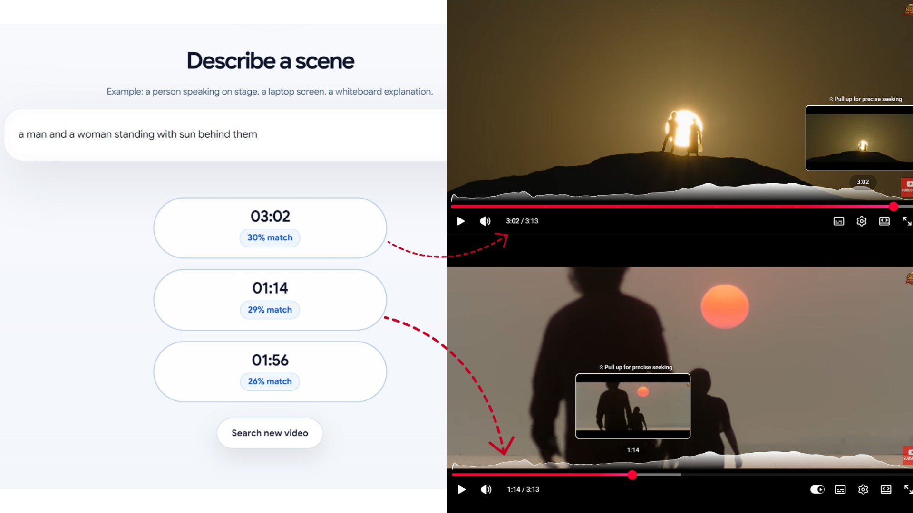
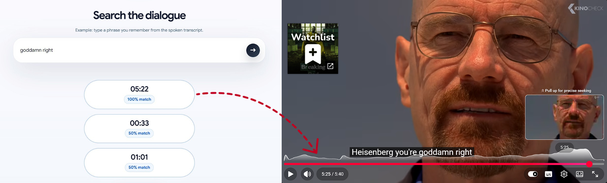
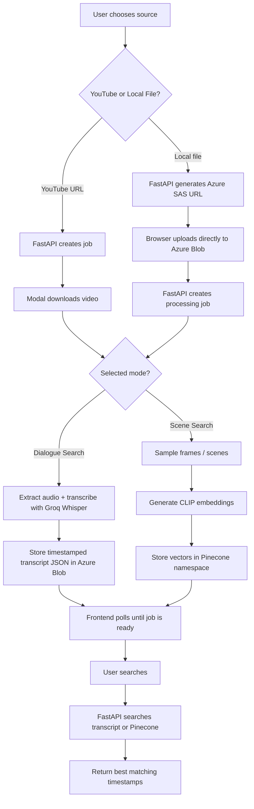

<h1>
  
  Momentum
</h1>

[]()
[]()
[]()
[]()
[]()
[]()
[]()
[]()
[]()
[]()

**Find the exact moment inside a YouTube video or Local file using visual scene description or dialogue memory**
<br>
<br>
[](https://momentum-seven-pearl.vercel.app)

🔗 [https://momentum-seven-pearl.vercel.app](https://momentum-seven-pearl.vercel.app)

---

## 🚀 Overview

Momentum solves a simple problem:

> Finding a specific moment inside a long video is slow when you only remember a scene or a line of dialogue.

Instead of manually scrubbing through the timeline, users can:

* Paste a **YouTube URL** or upload a **Local file**
* Choose **Scene Search** or **Dialogue Search**
* Process the video asynchronously
* Search using natural language
* Get the top matching timestamps

---

## Features

### 🖼 Scene Search

Search videos visually using natural language.



How it works:

```text
Video → PySceneDetect scene detection → Key frame extraction → CLIP embeddings → Pinecone → Text query search
```

ⓘ Note

**PySceneDetect** is a Python video-processing library that detects scene changes, allowing Momentum to extract meaningful frames instead of sampling randomly.

---

### 🔊 Dialogue Search

Search videos using remembered spoken words.



How it works:

```text
Video/audio → Transcription by Groq → Timestamped JSON → Dialogue search
```

---

### Main components

| Component           | Purpose                         |
| ------------------- | ------------------------------- |
| React + Vite        | Frontend UI                     |
| FastAPI             | API and orchestration           |
| Postgres / Supabase | Job status and metadata         |
| Modal               | Heavy audio/video processing    |
| Azure Blob Storage  | Media files and transcript JSON |
| Pinecone            | Scene vector storage and search |
| CLIP                | Visual embedding model          |
| Groq Whisper        | Speech transcription            |

---

<br>

<h2 align="center">
  🔄 Processing Flow
</h2>

<p align="center">
  <strong>How Momentum processes YouTube videos and Local files asynchronously</strong>
</p>

<br>



## ⚙️ Engineering Highlights

* Asynchronous job-based processing for long-running video tasks
* Direct-to-Azure upload using SAS URLs to avoid routing large files through FastAPI
* Pinecone namespaces per video/job for isolated vector search
* Cleanup logic for uploaded files and Pinecone vectors when starting a new search
* Backend CLIP warmup to reduce first-search latency
* Separate YouTube and Local file pipelines
* CPU-compatible demo setup with GPU-ready worker architecture

---

## ⚡ CPU vs GPU Processing

The current MVP processes video embeddings sequentially on CPU to keep the public demo lightweight and cost-efficient. Searching very long YouTube videos, such as a 3-hour movie, can therefore take around 15 minutes because CLIP embedding generation is computationally heavy.

For production-scale usage, the architecture is already designed to support the same pipeline by splitting long videos into smaller chunks and processing them in parallel across multiple Modal GPU workers. This would significantly reduce the processing workload and can improve indexing speed by around 60%.

```text
Long video
   ↓
Split into chunks
   ↓
Parallel Modal GPU workers
   ↓
CLIP embeddings per chunk
   ↓
Merged into one Pinecone namespace
```

## 📌 Limitations

* Local upload speed depends on user network
* Demo mode may be slower for longer videos when using CPU workers (mainly for Local files)
* Dialogue search is currently best suited for English transcripts

---

## 🧠 What this project demonstrates

Momentum demonstrates practical experience in:

* Full-stack AI application development
* Cloud orchestration across multiple services
* Asynchronous job processing
* Vector search architecture
* Video/audio processing pipelines
* Real-time progress-based frontend UX
* Production-style separation of frontend, backend, compute, storage, and vector database

---
ⓘ Note

This MVP is mainly built to validate the architecture, orchestration flow, and end-to-end search pipeline. The speed should be optimized by deploying the GPU Modal worker file which is already developed. 

